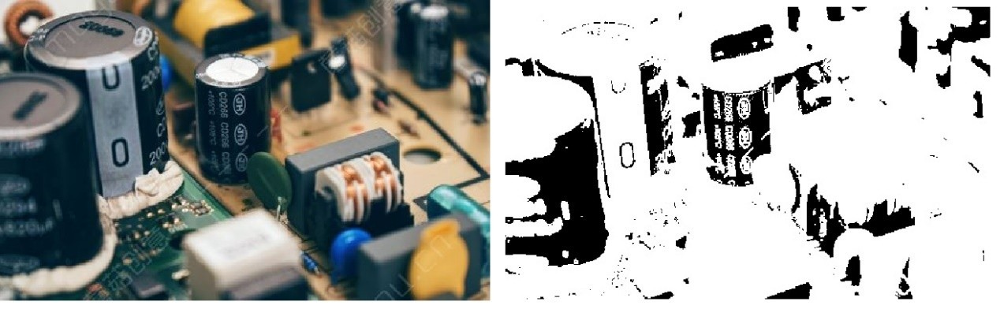
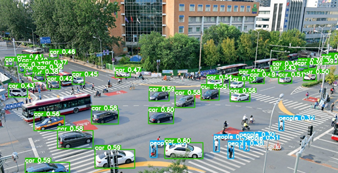
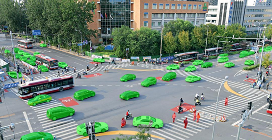
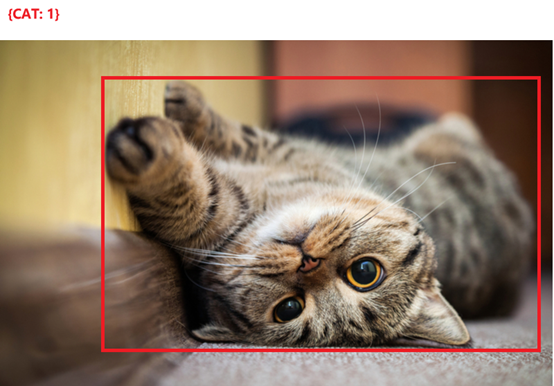
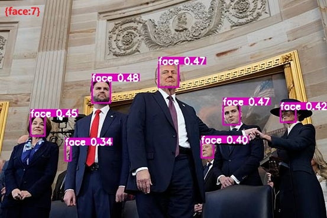
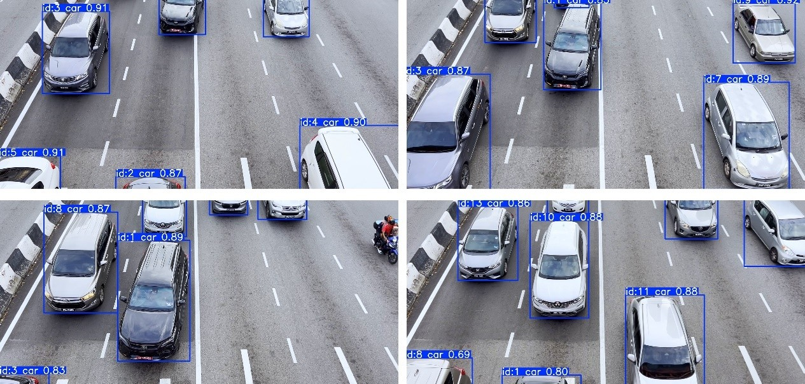
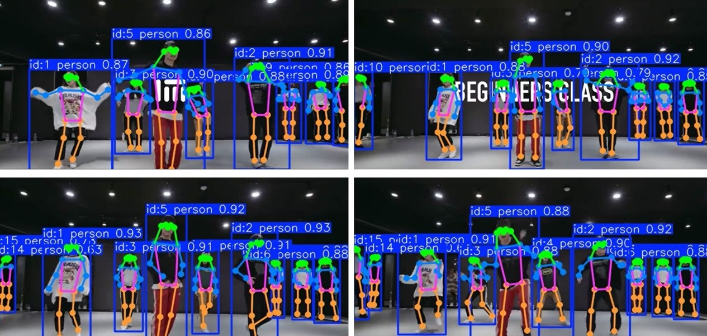
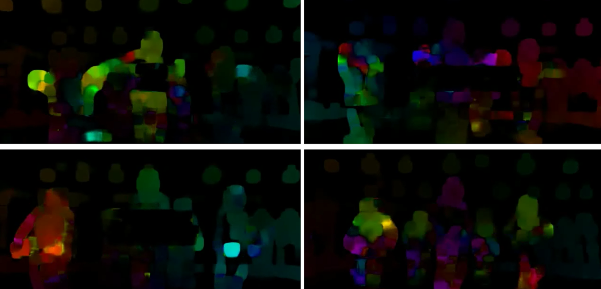

# Titan CV Agent Sandbox

Titan CV Sandbox is a highly modular and feature-rich computer vision (CV) environment designed to meet customized and complex CV requirements through practical task execution. At the same time, it leverages Docker and Kubernetes to encapsulate complex environments and execution logic, while exposing only a simple external interface. With its highly modular design, integrated advanced deep learning models, efficient hardware utilization, and rich functional modules, Titan CV Sandbox has become a powerful and flexible computer vision virtual environment. Its outstanding performance in image and video processing, target detection and tracking, segmentation and classification, multimodal interaction, and automated training and alarm systems gives it a significant competitive advantage in various application scenarios. Whether it is scientific research, industrial applications, or intelligent monitoring, Titan CV Sandbox can provide reliable, efficient, and professional solutions to meet the diverse needs of users.


## Titan CV Agent Series

[Titan CV Agent Sandbox](https://github.com/DataCanvasAILab/Titan-CV-Agent-Sandbox)

[Titan CV Agent Executor](https://github.com/DataCanvasAILab/Titan-CV-Agent-Executor)

[Titan CV Agent Benchmark](https://github.com/DataCanvasAILab/Titan-CV-Agent-Benchmark)


## Technical Features

**High modularity and scalability**: Each module (such as detection, segmentation, classification, etc.) operates independently, and users can flexibly combine and expand according to their needs to meet diverse application scenarios.

**Integration of various SOTA deep learning models**: Integrates SOTA model architectures such as YOLO series, DINO, LangSAM, PaddleOCR and Qwen series, to ensure high-precision and high-performance processing capabilities.

**Efficient hardware utilization**: Automatically identify and configure GPU devices, support half-precision calculations (FP16), greatly improve computing efficiency and processing speed, and adapt to large-scale data processing needs.

**Rich pre-processing and post-processing functions**: Provide comprehensive image and video processing tools, from data pre-processing to result post-processing, to ensure the quality of input data and the availability of output results.

**Multimodal processing capabilities**: Integrate visual language models and large language models to achieve deep fusion of images and texts, and support complex multimodal tasks such as visual question answering and natural language description generation.

**Automation and intelligence**: Includes automated model training and a responsive alarm system reduce manual intervention, improve the intelligence level and response capability of the system.

**Flexible output management**: Multiple output methods and structured results facilitate integration with other systems and further analysis of data, enhancing the practicality and adaptability of the system.

**User-friendly interface and configuration**: Through unified class structure and parameter configuration, the use and management of the system are simplified, and the user experience is improved.

**Reliable alarm and notification mechanism**: The built-in alarm system and multiple notification methods ensure timely response to key events, suitable for applications such as security monitoring and real-time monitoring.


## Core modules

### Supported CV tasks

| **Functions**        | **Subcategory**              | **Features**                           |
| -------------------- | ---------------------------- | -------------------------------------- |
| **Preprocessing**    | Image Adjustment             | - Resize                               |
|                      |                              | - Crop                                 |
|                      |                              | - Rotate                               |
|                      |                              | - Flip                                 |
|                      |                              | - Affine Transformation                |
|                      | Color Conversion             | - Color Space Conversion               |
|                      |                              |                                        |
| **Postprocessing**   | Image Filtering              | - Gaussian Blur                        |
|                      |                              | - Mean Blur                            |
|                      | Edge Detection               | - Canny Edge Detection                 |
|                      |                              | - Sobel Edge Detection                 |
|                      |                              | - Laplacian Edge Detection             |
|                      | Histogram Equalization       | - Histogram Equalization               |
|                      | Contour Detection            | - Contour Extraction                   |
|                      | Morphological Operations     | - Dilation                             |
|                      |                              | - Erosion                              |
|                      | Image Enhancement            | - Sharpening                           |
|                      |                              | - Add Noise                            |
|                      |                              | - Brightness Adjustment                |
|                      |                              | - Contrast Adjustment                  |
|                      |                              |                                        |
| **Detection**        | Object Detection             | - YOLO Series                          |
|                      |                              | - DINO zero-Shot Detection             |
|                      |                              | - Auto-YOLO Custom Model Trainer       |
|                      |                              |                                        |
| **Segmentation**     | Zero-Shot Segmentation       | - Based on LAN_SAM                     |
|                      |                              |                                        |
| **Classification**   | Zero-Shot Classification     | - Zero-Shot Classification             |
|                      | Custom Classification Models | - Trained Custom Classification Models |
|                      |                              |                                        |
| **Counting**         | Image Counting               | - Counting Objects in Images           |
|                      |                              |                                        |
| **Tracking**         | Region-Based Tracking        | - Video Region-Based Tracking          |
|                      |                              |                                        |
| **Pose Estimation**  | Human Keypoints              | - Human Bone/Pose/Keypoint Estimation  |
|                      |                              |                                        |
| **Optical Flow**     | Optical Flow Processing      | - Optical Flow Analysis                |
|                      |                              | - Optical Flow Synthesis               |
| **OCR**              | Region-Based OCR             | - OCR on Specific Regions              |
|                      |                              |                                        |
| **VLM / LLM**        | Task Responses               | - Regular Language Tasks               |
|                      |                              | - Multimodal Task Responses            |
|                      |                              |                                        |
| **Alarm**            | Alarm by Areas               | - Full Image Alarm                     |
|                      |                              | - Region-Based Alarm                   |
|                      | Alarm Methods                | - Trigger Alarm on Appearance          |
|                      |                              | - Trigger Alarm on Disappearance       |
|                      | Notification Methods         | - Email                                |
|                      |                              | - SMS                                  |
|                      |                              |                                        |
| **Output**           | Display                      | - Return to Front-End                  |
|                      | Logging                      | - Write to Log                         |
|                      | File Compression             | - Zip All Related Files                |
|                      |                              |                                        |
| **Video Processing** | Frame Processing             | - Frame Extraction                     |
|                      |                              | - RTMP Video Stream Sampling           |


### Description of each tasks

**Preprocessing:** Provides a variety of image processing functions, such as resizing, cropping, rotating, flipping, affine transformation, and color conversion. Supports batch processing of image path lists to ensure efficient data preprocessing process.


**Postprocessing:** Implements a variety of post-processing operations, including blur processing (Gaussian, mean, median), edge detection (Canny, Sobel, Laplacian), histogram equalization, threshold processing, contour drawing, and morphological operations. Flexible parameter configuration allows users to customize post-processing steps according to specific needs to improve the accuracy and visualization of the results.



**Detection:** Multi-model support: Integrates advanced detection models such as AutoYOLO, YOLO World, and DINO to meet detection needs in different scenarios. Efficient reasoning: Use GPU to accelerate the reasoning process, support half-precision (FP16) calculation, and improve processing speed. Scalability: Through flexible parameter configuration, users can adjust the confidence threshold, IOU threshold, maximum number of detection boxes, etc. as needed.



**Segmentation:** Based on the LangSAM model, it implements semantic segmentation and instance segmentation, supports fine segmentation of multiple categories and multiple regions. It provides a color mask overlay function to enhance the visualization of the segmentation results.



**Classification:** Supports zero-shot classification and YOLO-based classification methods to flexibly respond to different classification requirements. Through post-processing steps, the detection results are converted into classification results, providing category statistics and analysis.



**Counting:** Based on the detection results, automatically count the number of objects of each category in the image, supporting single image and batch image processing. Provide global and average counting results for easy data analysis and report generation.



**Tracking:** Enables object tracking in video streams, support multi-target tracking and path recording. Automatically save the tracking result video for subsequent analysis and review.



**Pose Estimation:** Estimates human body keypoints in real-time video. Provides pose tracking video output, suitable for behavior analysis and motion monitoring.



**Optical Flow:** Performs optical flow analysis to track object motion trajectories in the video. Suitable for motion analysis and dynamic scene understanding.



**OCR:** Supports text recognition in images, suitable for document processing and information extraction. Provides region recognition based on detection boxes to enhance the accuracy and positioning capabilities of OCR.


**VLM / LLM:**

VLM: Based on the Qwen-VL model, it realizes multimodal interaction between images and texts, and supports complex visual question-answering and description generation.

LLM: Integrates the Qwen-Chat model, provides powerful natural language understanding and generation capabilities, and supports complex conversations and information processing.


**Alarm:** According to the detection results, the alarm mechanism is automatically triggered, and users can be notified via email or SMS. Flexible alarm condition configuration is provided, such as detection area, category, and trigger threshold, to ensure timely response to key events.

**Output:** Supports multiple output methods, including real-time display, text file writing, and compressed package generation to meet the needs of different usage scenarios. Provides structured result output for easy subsequent processing and integration.

**Video Processing:** Supports frame extraction from video and real-time capture of RTMP streams, suitable for video analysis and real-time monitoring. Provides flexible frame sampling interval and duration configuration to ensure efficient video processing.


## Getting Started

### Local installation

#### Installation instructions

```bash
# 1. Basic installation, which will install some components that do not need to be modified and have existing versions.
# System-level installation package
apt-get update && apt-get install -y libgl1-mesa-glx libglib2.0-0 redis-server zip unzip 
# Create a conda environment. Ensure Conda or Miniconda is installed beforehand.
conda create -p {YOUR_SANDBOX_ENVIRONMENT_PATH} python==3.10.0 -y
# Activate the created Sandbox environment
conda activate {YOUR_SANDBOX_ENVIRONMENT_PATH}
# Go to the Sandbox working directory
cd {YOUR_SANDBOX_PATH}
# Install necessary dependencies. If the installation is slow, consider using '-i https://pypi.tuna.tsinghua.edu.cn/simple' to switch to a faster mirror source.
pip install -r requirements.txt

# 2. Environment parameter settings. All environments are only valid for the current window. Please consider writing them to ~/.bashrc for permanent effect.
# Sandbox working directory (for details, please refer to [Working Directory Structure])
export AGENT_ROOT={YOUR_SANDBOX_PATH}
# Sandbox model directory (for details, please refer to [Model Directory Structure])
export MODELS_ROOT={YOUR_MODELS_PATH}
# Sandbox environment directory
export ENV_ROOT={YOUR_SANDBOX_ENVIRONMENT_PATH}
# The calling address of your LLM/VLM can be any domestic or foreign manufacturer that supports the openai dialogue format, such as Openai/Siliconflow, etc., or a service deployed by yourself.
export BASE_LLM_URL=https://api.openai-proxy.org/v1/chat/completions
export BASE_VLM_URL=https://api.openai-proxy.org/v1/chat/completions
# If the call of LLM/VLM requires authentication, please enter the key. If no authentication is required, do not set it.
export ACCESS_KEY=sk-WP******
# Huggingface mirror acceleration address. (Applicable to areas where huggingface cannot be directly accessed)
export HF_ENDPOINT=https://hf-mirror.com
# CUDA installation path. Failure to set this may cause the subsequent GroundingDINO installation to fail
export CUDA_HOME=/usr/local/cuda
# For more parameter settings, see [Sandbox Parameters].

# 3. Extended installation, mainly installing some components that require fixed versions, have content modifications, and cannot be directly installed by pip.
# Install CLIP
unzip package/CLIP.zip -d package/clip && cd package/clip/CLIP-main && python setup.py install && cd ../../../
# Install Segment Anything
unzip package/segment-anything.zip -d package/segment-anything/ && cd package/segment-anything/segment-anything-main && pip install -e . && cd ../../../
# Install GroundingDINO, especially for Pillow / torch / torchvision versions. If pip install is slow, use "-i https://pypi.tuna.tsinghua.edu.cn/simple" to change the source after each installation instruction.
unzip package/GroundingDINO.zip -d package/grounding/ && pip install Pillow==9.4.0 && pip install torch==2.5.1 && pip install torchvision==0.20.1 && cd package/grounding/GroundingDINO-main && pip install -e . && cd ../../../

# 4. Startup instructions, please refer to [Startup instructions]
bash base/shell/start_worker.sh
```

> [!TIP]
>
> **The entire contents of the "models" folder can be downloaded from the following link:**
>
> [Google Drive](https://drive.google.com/file/d/1MfL20FYRdxgR9LEwUapFaZjfB3U6N6KH/view?usp=drive_link)


#### Installation Examples

```bash
apt-get update && apt-get install -y libgl1-mesa-glx libglib2.0-0 redis-server zip unzip 
conda create -p /datacanvas/envs/titan_cv_agent_sandbox python==3.10.0 -y
conda activate /datacanvas/envs/titan_cv_agent_sandbox
cd /datacanvas/code/agent_series/opensource/titan_cv_agent_sandbox
pip install -r requirements.txt -i  https://pypi.tuna.tsinghua.edu.cn/simple

export AGENT_ROOT=/datacanvas/titan_cv_agent_sandbox
export MODELS_ROOT=/datacanvas/titan_cv_agent_sandbox/models
export ENV_ROOT=/datacanvas/envs/titan_cv_agent_sandbox
export ACCESS_KEY=sk-******
export BASE_LLM_URL=https://api.openai-proxy.org/v1/chat/completions
export BASE_VLM_URL=https://api.openai-proxy.org/v1/chat/completions
export HF_ENDPOINT=https://hf-mirror.com
export CUDA_HOME=/usr/local/cuda

unzip package/CLIP.zip -d package/clip && cd package/clip/CLIP-main && python setup.py install && cd ../../../
unzip package/segment-anything.zip -d  package/segment-anything/ && cd package/segment-anything/segment-anything-main && pip install -e . && cd ../../../
unzip package/GroundingDINO.zip -d package/grounding/ && pip install Pillow==9.4.0 -i https://pypi.tuna.tsinghua.edu.cn/simple && pip install torch==2.5.1 -i https://pypi.tuna.tsinghua.edu.cn/simple && pip install torchvision==0.20.1 -i https://pypi.tuna.tsinghua.edu.cn/simple && cd package/grounding/GroundingDINO-main && pip install -e . && cd ../../../

bash base/shell/start_worker.sh
```


#### Necessary dependencies

```
ultralytics==8.2.87
Flask==3.0.3
celery==5.4.0
redis==5.2.1
paddlepaddle==2.6.2
paddleocr==2.8.1
transformers==4.45.1
hf_xet==1.0.2
Pillow==9.4.0
```


#### Working directory structure

```
titan_cv_agent_sandbox/ #Working directory, which can be the specified location of AGENT_ROOT.
├── base/ #Core file
│ ├── logs/ #Default log storage location
│ ├── shell/ #Command line
│ │ ├── start_worker.sh #Start Sandbox worker
│ │ └── stop_worker.sh #Close Sandbox worker
│ ├── api.py #Process service request
│ ├── base_config.py #Basic configuration
│ ├── celery_worker.py #Celery worker related
│ ├── func_mapping.py #Startup mapping for Base function
│ └── task.py #Specific implementation of each visual task.
├── lang_sam/ # Modified lang_sam package
├── test/ # Test class
│ └── activate_request.py # Dedicated test script that can call most parameters of all functions at once after starting the service
├── atools.py # Some practical tools
├── env/ # Conda environment directory, can be in any independent location
├── models/ # Some pre-trained weights, can be in any independent location

```


#### Independent directory structure

**models**

```
models/
├── base/
│   ├── yolov8n.pt
│   ├── yolov8x-pose.pt
│   └── yolov8x-worldv2.pt
├── cache/
│   ├── clip/
│   │   └── ViT-B-32.pt
│   ├── hf/
│   │   ├── hub/
│   │   │   ├── models--bert-base-uncased/
│   │   │   └── models--ShilongLiu--GroundingDINO/
│   │   └── modules/
│   └── torch/
│       ├── hub/
│       └── kernels/
```

**packages**

```
package/
├── CLIP.zip
├── GroundingDINO.zip
└── segment-anything.zip
```


#### Sandbox Parameters

```bash
# The following parameters can be obtained from environment variables, and the variables with the same name can be set from the environment
# Sandbox working directory (refer to [Working Directory Structure])
AGENT_ROOT = "/datacanvas/titan_cv_agent_sandbox"
# Sandbox model directory (refer to [Model Directory Structure])
MODELS_ROOT = "/datacanvas/titan_cv_agent_sandbox/models"
# If the call of LLM/VLM requires authentication, ACCESS_KEY is required
ACCESS_KEY = ""
# LLM's calling model name.
BASE_LLM_MODEL_NAME = "gpt-4o"
# LLM's calling model address.
BASE_LLM_URL = "https://api.openai.com/v1/chat/completions"
# VLM's calling model name.
BASE_VLM_MODEL_NAME = "gpt-4o"
# VLM's calling model address.
BASE_VLM_URL = "https://api.openai.com/v1/chat/completions"
# Start the local address of Sandbox Flask
BASE_FLASK_ADDR = "0.0.0.0"
# Start the local port bound to Sandbox Flask
BASE_FLASK_PORT = 52001
# Save the log location of CELERY APP
BASE_LOGGER_APP_PATH = "{AGENT_ROOT}base/logs/app.log"
# Save the log location of CELERY WORKER
BASE_LOGGER_WORKER_PATH = "{AGENT_ROOT}base/logs/worker.log"
# Save the output file image/video
BASE_LOCAL_OUTPUT_PREFIX = "{AGENT_ROOT}output/"

# Allocate tasks that only use cpu in Celery
CPU_TASK = ["preprocess","postprocess","alarm","output","videoprecess"]
# In Celery, assign tasks that require more GPU usage, and the rest of the tasks default to tasks that use less GPU usage. Celery will allocate different resources based on the type of task.
GPU_HEAVY_TASK = ["llm", "vlm"]
# REDIS_BROKER address, you can keep the default
REDIS_BROKER = 'redis://localhost:6379/0'
# REDIS_BACKEND address, you can keep the default
REDIS_BACKEND = 'redis://localhost:6379/1'
# YOLOV8N model weight address, this model may be used in detection/classification in basic tasks.
YOLOV8N = "{MODELS_ROOT}base/yolov8n.pt"
# YOLOV8N model weight address, this model may be used in pose in basic tasks.
YOLOV8X_POSE = "{MODELS_ROOT}base/yolov8x-pose.pt"
#YOLOV8N model weight address, this model may be used in detection/classification zeroshot processing in basic tasks.
YOLOV8X_WORLDV2 = "{MODELS_ROOT}base/yolov8x-worldv2.pt"
#Specify the local huggingface directory, suitable for offline use of Sandbox
BASE_HF_HOME = "{MODELS_ROOT}cache/hf"
#Specify the local torch directory, suitable for offline use of Sandbox
BASE_TORCH_HOME = "{MODELS_ROOT}cache/torch"
#Huggingface mirror acceleration address. (Applicable to areas where huggingface cannot be directly accessed)
BASE_HF_ENDPOINT = "https://hf-mirror.com"
```


#### Startup Instructions

**base/shell/start_worker.sh**

```bash
#!/bin/bash
# Get AGENT_ROOT working directory from the environment
AGENT_ROOT="${AGENT_ROOT:-/datacanvas/sandbox/cv/code}"
# Get ENV_ROOT environment directory from the environment
ENV_ROOT="${ENV_ROOT:-/datacanvas/sandbox/cv/envs}"
# Automatically calculate the log directory
LOG_ROOT=${AGENT_ROOT}/base/logs
# Create a log directory
mkdir -p "$LOG_ROOT"
# Start Redis
echo "Startup Redis Server..."
# Direct Redis log file
nohup redis-server > ${AGENT_ROOT}/base/logs/redis.log 2>&1 &
# Start celery workers
echo "Startup Workers..."
conda run --no-capture-output -p ${ENV_ROOT}
# Start workers according to different celery levels
cd ${AGENT_ROOT}/base
nohup celery -A celery_worker.app worker --loglevel=info --concurrency=2 -Q cpu_queue > ${LOG_ROOT}/cpu_queue.log 2>&1 &
CUDA_VISIBLE_DEVICES=0 nohup celery -A celery_worker.app worker --loglevel=info --concurrency=2 -Q gpu_light_queue > ${LOG_ROOT}/gpu_light_queue.log 2>&1 &
CUDA_VISIBLE_DEVICES=0 nohup celery -A celery_worker.app worker --loglevel=info --concurrency=2 -Q gpu_heavy_queue > ${LOG_ROOT}/gpu_heavy_queue.log 2>&1 &
# Specify the environment to start Flask
echo "Startup Flask..."
cd ${AGENT_ROOT}/base
python api.py
echo "All services have been started. Check log files for details."
```


### Kubernetes Installation

**Kubernetes startup script**

```
cd d:/k8s && set KUBECONFIG=kube_config
kubectl apply -f titan-cv-agent-opensource-sandbox-deployment.yaml
kubectl apply -f titan-cv-agent-opensource-sandbox-svc.yaml
```

**titan-cv-agent-opensource-sandbox-deployment.yaml**

```
apiVersion: apps/v1
kind: Deployment
metadata:
  name: titan-cv-agent-opensource-sandbox-deployment
  namespace: develop
  labels:
    app: titan-cv-agent-opensource-sandbox-deployment
spec:
  replicas: 1 
  selector:
    matchLabels:
      app: titan-cv-agent-opensource-sandbox-deployment
  template:
    metadata:
      labels:
        app: titan-cv-agent-opensource-sandbox-deployment
    spec:
      restartPolicy: Always
      containers:
        - name: titan-cv-agent-opensource-sandbox-deployment
          image:  xxx.com:1234/titan_cv_agent_sandbox:0.4
          ports:
            - containerPort: 52001
          resources:
            requests:
              memory: "16Gi"
              cpu: "8"
              nvidia.com/gpu: 1
            limits:
              memory: "32Gi"
              cpu: "8"
              nvidia.com/gpu: 1
          volumeMounts:
            - name: models
              mountPath: "/models"

          workingDir: /datacanvas/titan_cv_agent_sandbox/base
          env:
            - name: HF_HOME
              value: "/datacanvas/titan_cv_agent_sandbox/models/cache/hf"
            - name: TORCH_HOME
              value: "/datacanvas/titan_cv_agent_sandbox/models/cache/torch"
            - name: HF_ENDPOINT
              value: "https://hf-mirror.com"
            - name: AGENT_ROOT
              value: "/datacanvas/titan_cv_agent_sandbox"
            - name: MODELS_ROOT
              value: "/datacanvas/titan_cv_agent_sandbox/models"
            - name: ENV_ROOT
              value: "/datacanvas/titan_cv_agent_sandbox/env"
            - name: ACCESS_KEY
              value: "sk-WP******"
            - name: BASE_LLM_URL
              value: "https://api.openai-proxy.org/v1/chat/completions"
            - name: BASE_VLM_URL
              value: "https://api.openai-proxy.org/v1/chat/completions"
            - name: BASE_LOCAL_OUTPUT_PREFIX
              value: "/output"

      imagePullSecrets:
        - name: harbor-secret
      volumes:
        - name: models
          persistentVolumeClaim:
            claimName: models
        - name: shm
          emptyDir:
            medium: Memory
            #sizeLimit: "10Gi"
```

**titan-cv-agent-opensource-sandbox-svc.yaml**

```
apiVersion: v1
kind: Service
metadata:
  name: titan-cv-agent-opensource-sandbox-service
  namespace: develop
spec:
  type: ClusterIP
  ports:
    - name: titan-cv-agent-opensource-sandbox-deployment
      port: 52001
      targetPort: 52001
      protocol: TCP
  selector:
    app: titan-cv-agent-opensource-sandbox-deployment
```

### API

#### Request Parameters

The resource needs to be located in a mounted and available path and its sub-paths. The resource will return the Docker internal address or mounted directory.

| **Parameter name** | **Type** | **required** | **describe**                                                 |
| ------------------ | -------- | ------------ | ------------------------------------------------------------ |
| **function_name**  | String   | Yes          | The name of the function to be called, such as "vlm"         |
| **arguments**      | Dict     | Yes          | The specific parameters of the function vary according to the function |

**Example**

```
step = {        
    "function_name" : "vlm",        
    "arguments" : {"image_path":'/models/xxx.jpg', "query":'What do you see?'}
}
```


**Arguments for different functions**

| **Function** | **Parameter name** | **Type** | **required** | **Default value** | **Description** |
| -------------------------- | -------------------------------- | -------------------- | ------------ | ------------------------------------------------------- | -------------------------------------------------------- |
| **Preprocess** | image_path_list | str, List[str] | Yes | None | Input image path or path list. |
| resize_dims | Tuple[int, int] | No | None | Resample size (width, height). | |
| crop_coords | Tuple[int, int, int, int] | No | None | Crop coordinates (x, y, width, height). | |
| rotate_angle | float | No | None | Rotation angle. | |
| rotate_center | Tuple[int, int] | No | None | Rotation center (x, y). | |
| rotate_scale | float | No | None | Rotation scale. | |
| flip_code | int | No | None | Flip code (0 vertical, 1 horizontal, -1 both). | |
| affine_translation | Tuple[int, int] | No | None | Affine transform offset (x, y). | |
| color_conversion | int | No | None | Color conversion code (e.g. 6 for BGR2GRAY). | |
| **Postprocess** | image_path_list | str, List[str] | Yes | - | Input image path or list of paths. |
| blur_type | str | No | None | Blur type (gaussian, median, mean). | |
| blur_ksize | Tuple[int, int] | No | None | Blur kernel size (width, height). | |
| canny_thresholds | Tuple[int, int] | No | None | Canny edge detection thresholds (low, high). | |
| equalize_hist | bool | No | False | Whether to apply histogram equalization. | |
| thresholding | Tuple[int, int, int] | No | None | Thresholding (threshold, max, type). | |
| draw_contours | bool | No | False | Whether to draw contours. | |
| morphology | Tuple[int, Tuple[int, int], int] | No | None | Morphological operation parameters (operation type, kernel size, number of iterations). | |
| sobel_edges | Tuple[int, int, int] | No | None | Sobel edge detection parameters (dx, dy, kernel size). | |
| laplacian_edges | bool | No | False | Whether to apply Laplacian edge detection. | |
| sharpen | bool | No | False | Whether to apply a sharpening filter. | |
| add_noise | bool | No | False | Whether to add noise. | |
| change_brightness_contrast | Tuple[int, int] | No | None |||
| Adjust brightness and contrast (brightness, contrast). | |||||
| **Detection** | image_path_list | str, List[str] | Yes | - | Path or list of paths to input images. |
| query_list | str, List[str] | Yes | - | List of object classes to detect. | |
| method | str | No | "dino" | Detection method (dino, yolo_world). | |
| confidence_threshold | float | No | None | Confidence threshold. | |
| iou_threshold | float | No | None | IoU threshold. | |
| image_resize | Tuple[int, int] | No | None | Resample image (width, height). | |
| fp16_inference | bool | No | False | Whether to use FP16 inference. | |
| max_bboxes | int | No | None | Maximum number of bounding boxes to detect. | |
| detect_classes | List[int] | No | None | List of numeric classes to specify the objects to detect. | |
| high_resolution | bool | No | False | Whether to enable high resolution mode. | |
| **Segmentation** | image_path_list | str, List[str] | Yes | - | Path or list of paths to input images. |
| query_list | str, List[str] | Yes | - | List of classes to segment objects. | |
| method | str | No | "lan_sam" | Segmentation method to use. | |
| bbox_threshold | float | No | 0.3 | Confidence threshold for bounding boxes. | |
| text_threshold | float | No | 0.25 | Confidence threshold for text. | |
| **Classification** | image_path_list | str, List[str] | Yes | - | Path or list of paths to input images. |
| query_list | str, List[str] | Yes | - | List of object classes to be classified. | |
| method | str | No | "yolo_world" | Classification method. | |
| confidence_threshold | float | No | None | Confidence threshold. | |
| iou_threshold | float | No | None | IoU threshold. | |
| classes | List[int] | No | None | List of numeric classes to specify objects to be classified. | |
| **Counting** | image_path_list | str, List[str] | Yes | - | Path or list of paths to input images. |
| query_list | str, List[str] | Yes | - | List of object classes to be counted. | |
| **Tracking** | video_path | str | Yes | - | Video path to track. |
| query_list | str, List[str] | Yes | - | List of object classes to track. | |
| **Pose** | video_path | str | Yes | - | Input video path. |
| **OpticalFlow** | video_path | str | Yes | - | Input video path for optical flow detection. |
| **OCR** ​​| image_path_list | str, List[str] | Yes | - | Input image path or list of paths. |
| bbox_region | List[str] | No | None | Bounding box region to use for OCR. | |
| ocr_threshold | float | No | 0.1 | OCR confidence threshold. | |
| **VLM** | image_path | str | Yes | - | Input image path. |
| query | str, List[str] | Yes | - | A single query string or a list of queries to be processed. | |
| **LLM** | query | str, List[str] | Yes | - | Question or query to input to the large language model, which can be a string or a list to be concatenated. |
| **Alarm** | result_obj | dict | Yes | - | Result object of the previous step, which must contain image_path_list and boxes_list. |
| detect_region | list | No | None | Region to be detected, in the format of bounding box coordinates. | |
| detect_class | list[str] | Yes | - | List of object classes to be detected. | |
| detect_method | str | No | "appear" | Detection method, you can choose "appear" or "disappear". | |
| notice_email_or_tel | str | No | None | Notification method, which can be an email address or a mobile phone number. | |
| alarm_threshold | int | No | 0 | Threshold for triggering an alarm. | |
| **Output** | result_obj | dict, str, List[str] | Yes | - | Output result of the previous step. |
| method | str | No | "show" | Output method, you can choose "show", "write" or "zip". | |
| **AutoyoloTrainer** | image_path_list | str, List[str] | Yes | - | Training image path list. |
| query_list | list[str] | Yes | - | Query category list. | |
| train_epoch | int | No | 100 | Total number of epochs for training. | |
| **VideoPrecess** | video_path | str | No | None | Input video path. |
| method | str | Yes | "get_frames" | Select function: "get_frames" extracts frames, "rtmp_capturer" captures RTMP streams. | |
| interval | int | No | 1 | Interval between extracting frames (seconds). ||
| rtmp_url | str | No | None | URL address of RTMP stream. | |
| rtmp_duration | int | No | 10 | Total duration of RTMP stream sampling (seconds). | |


#### **Return value**

**Response parameters**

| Field | Type | Description |
| ------- | ------- | ------------------------------------------------ |
| code | Integer | Status code |
| data | Object | The returned data content varies depending on the calling function |
| message | String | Status information, "success" is displayed for success, and specific errors are displayed for failure. |

**Status code description**

| Status code | Description |
| ------ | -------------------------------- |
| -1 | Request failed, see message for specific error information |
| 1 | Request successful |

**Example**

```
{"code":1,"data":{"vlm_result":"Tv"},"message":"success"}
```


## Acknowledgments

**This project is supported by**

***[Datacanvas - Empowering AI Native Businesses Worldwide](https://www.datacanvas.com/en/AboutUs)***

> TEL: +86 400-805-7188
>
> Email: sophia@zetyun.com
>
> Beijing Office: 6F&8F, Building C, HEYING Center, 10 Xiaoyingxi Road, Haidian District, Beijing, China
>
> Shanghai Office: 10F, Building 1, SHIBEI TBC Center, Lane 1401, Jiangchang Road, Jing'an District, Shanghai, China


**This project uses or references the following repositories:**

[ultralytics](https://github.com/ultralytics/ultralytics)

[PaddleOCR](https://github.com/PaddlePaddle/PaddleOCR)

[CLIP](https://github.com/openai/CLIP)

[GroundingDINO](https://github.com/IDEA-Research/GroundingDINO)

[segment-anything](https://github.com/facebookresearch/segment-anything)

[lang-segment-anything](https://github.com/luca-medeiros/lang-segment-anything)


## License

**Titan CV Sandbox uses the following license agreement:**

**Apache License Version 2.0**

**The licenses of the components used in this project are as follows:**

**ultralytics** [AGPL-3.0 license](https://github.com/ultralytics/ultralytics#)

**PaddleOCR** [Apache-2.0 license](https://github.com/PaddlePaddle/PaddleOCR#)

**CLIP** [MIT license](https://github.com/openai/CLIP?tab=MIT-1-ov-file#)

**segment-anything** [Apache-2.0 license](https://github.com/facebookresearch/segment-anything?tab=Apache-2.0-1-ov-file#)

**GroundingDINO** [Apache-2.0 license](https://github.com/IDEA-Research/GroundingDINO#)

**lang-segment-anything** [Apache-2.0 license](https://github.com/luca-medeiros/lang-segment-anything?tab=Apache-2.0-1-ov-file#)